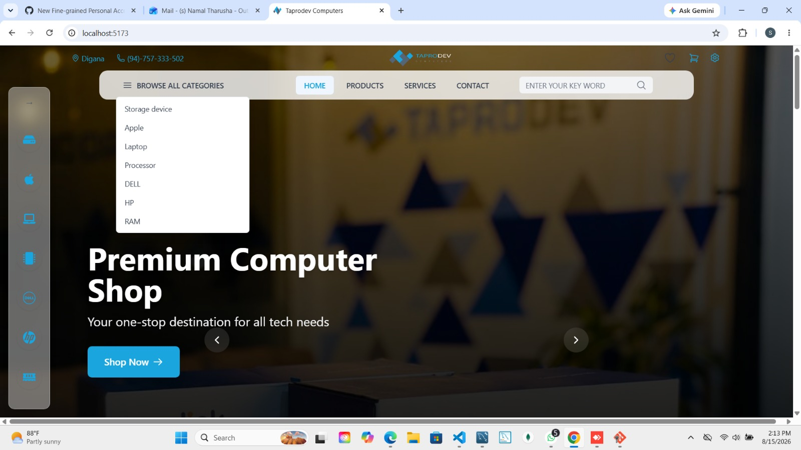
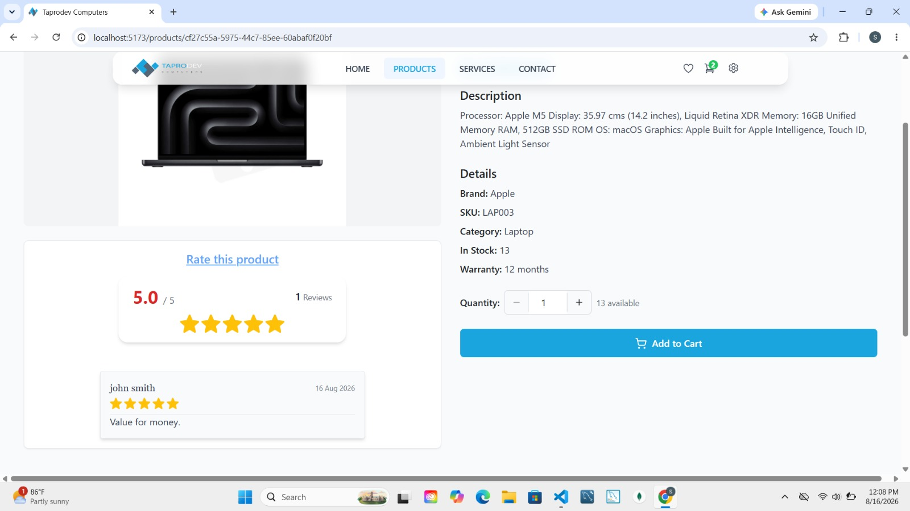
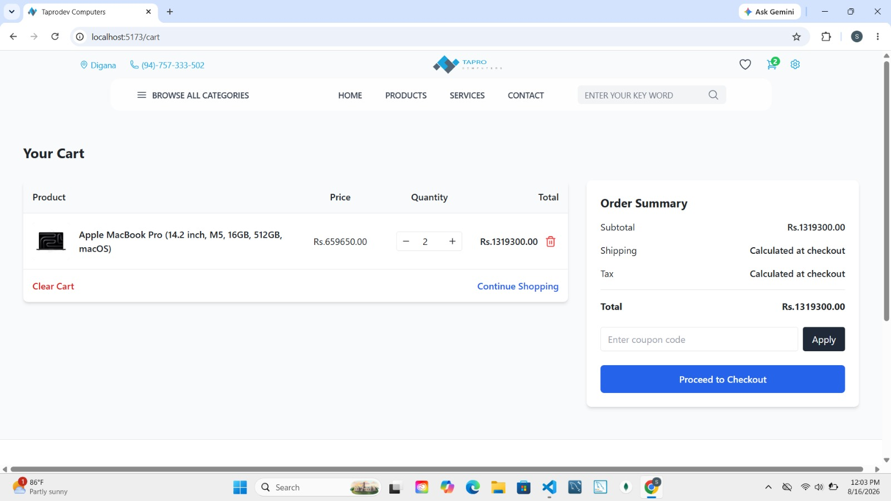
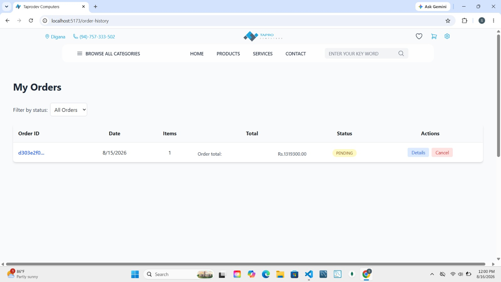
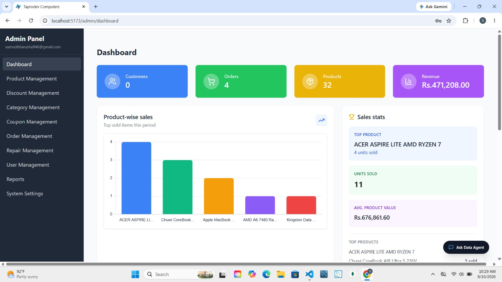
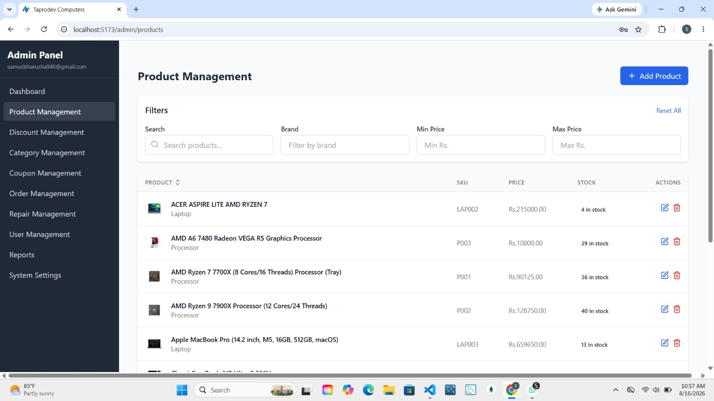
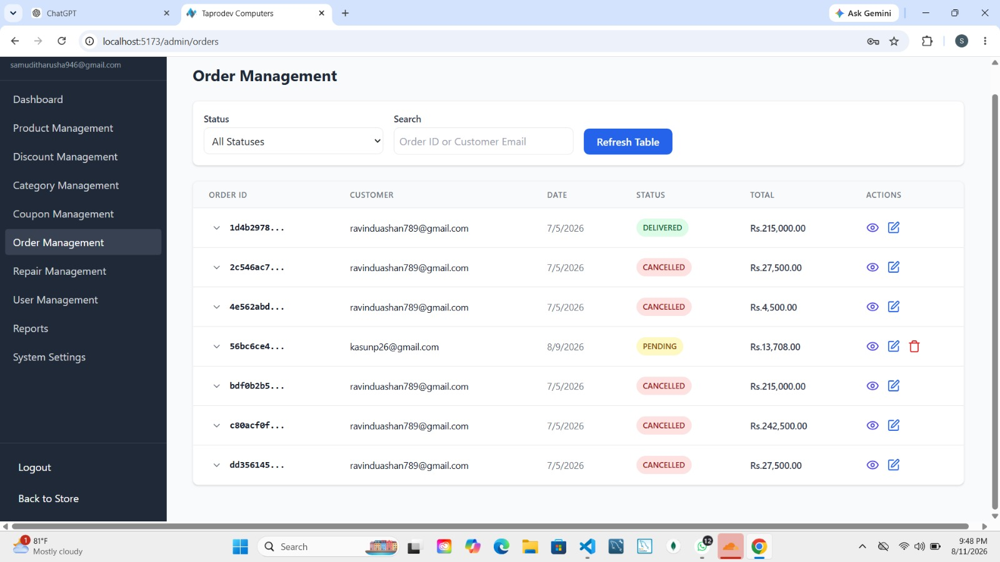
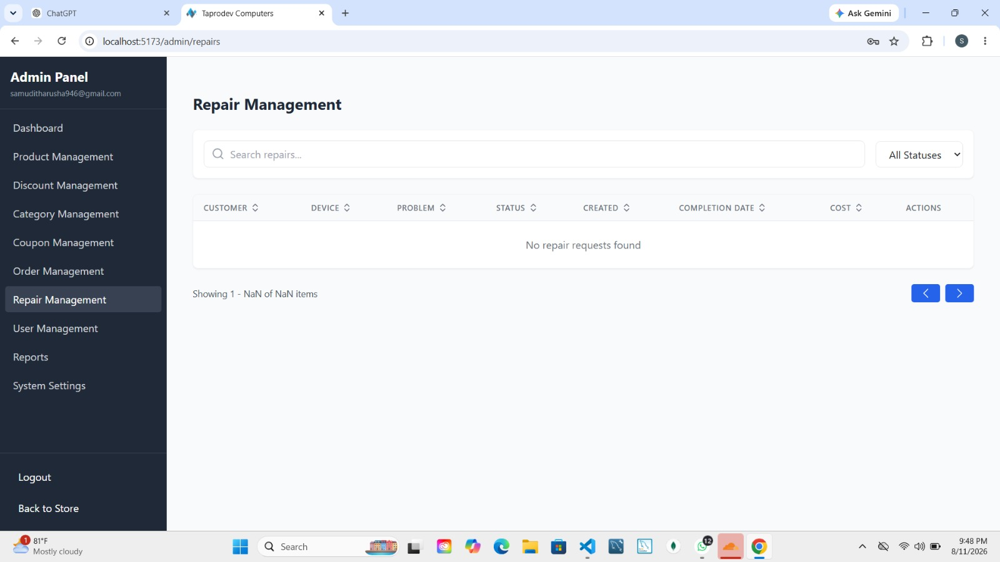
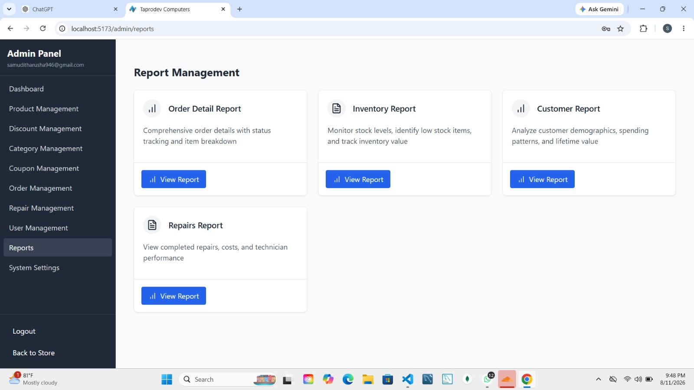

<div align="center">

# Taprodev

**Web -Based Computer Hardware E-Cmmerce Management System**

Built with Spring Boot, React, and MySQL — combining a customer storefront with an operational back office for a computer hardware retailer.

</div>

---

## Table of Contents

- [Overview](#overview)
- [Screenshots](#screenshots)
- [Features](#features)
- [Tech Stack](#tech-stack)
- [Getting Started](#getting-started)
- [Project Structure](#project-structure)
- [Known Limitations](#known-limitations)
- [License](#license)

## Overview

Small and medium computer hardware retailers typically manage sales, stock, and repair services through disconnected tools — spreadsheets, basic point-of-sale terminals, and paper or messaging-app-based repair logs. Taprodev unifies these into a single system: a specification-rich product catalogue and transactional storefront for customers, and a role-separated operational back office for staff, sharing one data model and one authentication layer.

Access is controlled by JWT-based authentication across three roles — **Customer**, **Admin**, and **Technician** — each scoped to the functionality relevant to them.

## Screenshots

### Customer storefront

<table>
<tr>
<td width="50%"><br/><sub>Home page</sub></td>
<td width="50%"><br/><sub>Product detail with specifications and reviews</sub></td>
</tr>
<tr>
<td width="50%"><br/><sub>Cart and order summary</sub></td>
<td width="50%"><br/><sub>Order history and status tracking</sub></td>
</tr>
</table>

### Admin & operations panel

<table>
<tr>
<td width="50%"><br/><sub>Dashboard — customers, orders, revenue, sales</sub></td>
<td width="50%"><br/><sub>Product management</sub></td>
</tr>
<tr>
<td width="50%"><br/><sub>Order management</sub></td>
<td width="50%"><br/><sub>Repair job tracking</sub></td>
</tr>
<tr>
<td colspan="2"><br/><sub>Reporting hub — inventory, orders, customers, repairs</sub></td>
</tr>
</table>

## Features

### Customer

- Registration and login (JWT-based)
- Product browsing, search, and category filtering
- Product detail pages with specifications, stock, and images
- Shopping cart and wishlist
- Coupon application at checkout
- Secure checkout via Stripe
- Order placement, tracking, and returns
- Product reviews
- Reward points and loyalty tier
- Repair request submission and status tracking

### Admin

- Dashboard: customers, orders, products, revenue, order status distribution
- Product, category, and stock management
- Discount and coupon management
- Order and returns management
- User management
- Repair job oversight
- Reporting, including an AI-assisted natural-language query feature for ad-hoc business questions
- System settings

### Technician

- Scoped access to assigned repair requests
- Diagnostic notes and repair status updates, visible to the customer

## Tech Stack

| Layer | Technology |
|---|---|
| Backend | Spring Boot 3.4.2, Spring Security (JWT), Spring Data JPA, MapStruct, Lombok |
| Frontend | React 18, Vite |
| Database | MySQL |
| Payments | Stripe (test/sandbox mode for development) |
| Email | SMTP (order and authentication notifications) |

## Getting Started

### Prerequisites

- JDK 17
- Maven (or the bundled Maven Wrapper)
- Node.js 18+ and npm
- A running MySQL instance

### 1. Create the database

```sql
CREATE DATABASE computer_shop;
```

### 2. Configure the backend

Copy `backend/csm/.env.example` to `.env` (or set equivalent environment variables) and fill in:

- `DB_URL`, `DB_USERNAME`, `DB_PASSWORD`
- `JWT_SECRET_KEY`, `JWT_EXPIRATION`
- `SERVER_PORT` (default `8080`)
- `STRIPE_SECRET_KEY` (use a Stripe **test-mode** key)
- `MAIL_HOST`, `MAIL_PORT`, `MAIL_USERNAME`, `MAIL_PASSWORD`

The schema is created automatically on first run — no manual migration step is needed.

### 3. Configure the frontend

Copy `frontend/Computer_Shop/.env.example` to `.env` and set `VITE_API_BASE_URL` to your backend address (e.g. `http://localhost:8080`).

### 4. Run the app

```bash
# Backend
cd backend/csm
mvn spring-boot:run

# Frontend (in a separate terminal)
cd frontend\Computer_Shop
npm install
npm run dev
```

- Backend API: `http://localhost:8080`
- Frontend: `http://localhost:5173`

### 5. Get admin/technician access

All new registrations default to the **Customer** role. To demonstrate the Admin or Technician views, register a normal account through the app, then promote it directly in the database:

```sql
UPDATE users SET role = 'ADMIN' WHERE email = 'your-account@example.com';
-- or
UPDATE users SET role = 'TECHNICIAN' WHERE email = 'your-account@example.com';
```

Log out and back in after promotion so a new token is issued with the updated role.

### 6. Test payments

Checkout uses Stripe's test mode. Use one of [Stripe's published test card numbers](https://docs.stripe.com/testing) (e.g. `4242 4242 4242 4242`, any future expiry, any CVC) — never real card details.

## Project Structure

```
taprodev/
├── backend/csm/              # Spring Boot API
├── frontend/Computer_Shop/   # React + Vite storefront and admin portal
└── screenshots/              # README screenshots
```

## Known Limitations

This project documents its own limitations rather than hiding them:

- **AI query endpoint** is protected by a keyword blocklist rather than a parameterised, schema-restricted query interface.
- **Schema management** currently relies on Hibernate `ddl-auto=update` rather than version-controlled Flyway migrations, despite Flyway being configured as a dependency.
- **No automated test suite** — validation has been done through structured manual testing only.

Full detail on each of these, and the corresponding future-work plan, is in the project report.

## License

Academic project — for coursework/demonstration purposes.
